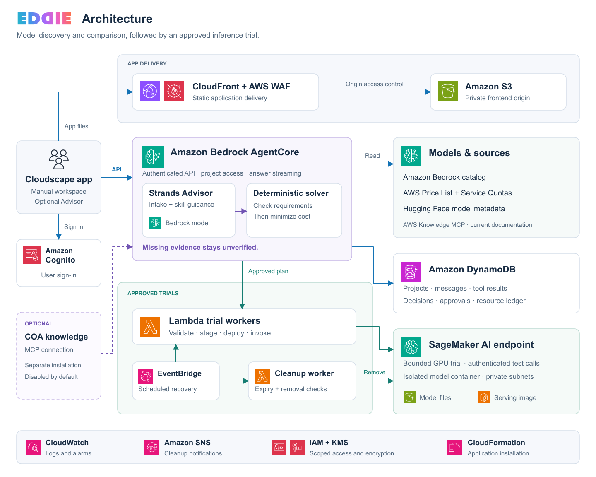

# Architecture and supported paths

## How it works

1. **Workspace:** React and Cloudscape run in the browser. CloudFront and WAF
   deliver the static application from an S3 origin protected by origin access control.
2. **Identity and API:** Cognito signs users in. The browser calls AgentCore
   directly with its access token. The runtime verifies identity and checks
   action and project permissions.
3. **Decisions:** the optional Strands Advisor handles conversation and tools.
   A separate deterministic solver checks requirements, then compares costs
   among qualifying candidates. AWS pricing, model metadata and account checks
   provide evidence; missing evidence never becomes a pass. The Advisor reads
   packaged skills for decision methods and retrieves current AWS documentation
   through a restricted, read-only AWS Knowledge MCP connection. See the
   [knowledge sources and outbound boundary](advisor-knowledge.md).
4. **Persistence:** DynamoDB stores projects, Strands messages and tool results,
   decisions, approved plans, jobs and resource records. Conversations use a
   bounded context window while retaining their durable session history.
5. **Execution:** Lambda controllers validate approval and advance the supported
   SageMaker trial. Model artifacts are staged in S3 and a reviewed, digest-pinned
   serving image is stored in ECR. Test invocation uses authenticated service calls.
6. **Cleanup:** EventBridge schedules job recovery and an independent Lambda
   reconciler. Workers use the durable resource ledger; deletion is only complete
   when removal is confirmed. CloudWatch alarms and SNS carry cleanup notifications.

The figure simplifies individual SDK calls. CloudFront WAF covers the static
delivery path; it is not on the direct AgentCore API path. The SageMaker container
is network-isolated and configured with private subnets; this does not mean the
SageMaker service API itself has become a private endpoint.

## Supported paths

| Path | Current capability |
| --- | --- |
| Native Amazon Bedrock | Live catalog selection and supported Standard text-token cost comparison. Access and performance still require verification. |
| Bedrock Custom Model Import | Compatibility and active-copy cost comparison for supported configurations. Import deployment is not implemented. |
| SageMaker AI | Supported instance cost comparison and one approval-gated, bounded Qwen trial recipe. |
| EC2 / EKS / HyperPod | Broader discovery and deployment are roadmap work, not completed execution paths. |
| Quality and performance | Supplied-answer scoring and evidence-aware checks. Automated model-invoking quality suites and load benchmarks remain in progress. |
| AWS documentation | Live AWS Knowledge MCP retrieval for Advisor service questions, with per-answer source receipts. No account or deployment authority. |
| COA knowledge | Optional MCP adapter to a separately installed Context Ontology Accelerator. Disabled by default; no graph/search stack is silently installed. |

An inspected model is not automatically deployable. A priced option is not
automatically qualified. One successful request is not a p99 benchmark.

## Access and operations

The runtime derives identity from the verified token, never from an Advisor
argument or a submitted project identifier. New signed-in users can work with
their own projects and chat; spending and operating permissions require explicit
Cognito group membership.

| Group | Capability |
| --- | --- |
| `eddie-readers` | Read-only project and evidence access. |
| `eddie-users` | Project work and Advisor conversation. |
| `eddie-deployers` | Create trial plans and request removal; cannot approve a plan. |
| `eddie-approvers` | Approve and run the supported trials, and request removal. |
| `eddie-operators` | Also operate the optional knowledge-stack lifecycle. |

Create only the groups needed in your installation and assign users deliberately.
An SNS email recipient must confirm the subscription before receiving alarms.
Use the recorded plan, deployment state and cleanup evidence when operating trials.

## Diagram source

The figure uses official [AWS Architecture Icons](https://aws.amazon.com/architecture/icons/).
It describes the implementation in `infra/cloudformation/application/eddie-app.yaml`,
`backend/runtime/`, `backend/deploy/` and `frontend/src/`.

Regenerate it with `python3 scripts/render_architecture.py --png`.
The SVG and PNG are self-contained and contain no account IDs, customer information
or installation-specific endpoints.
